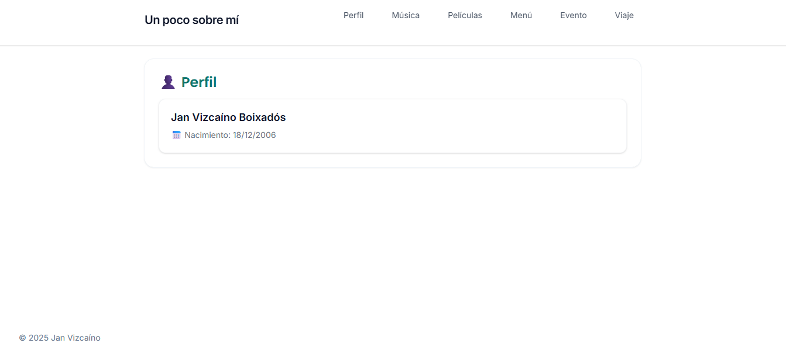
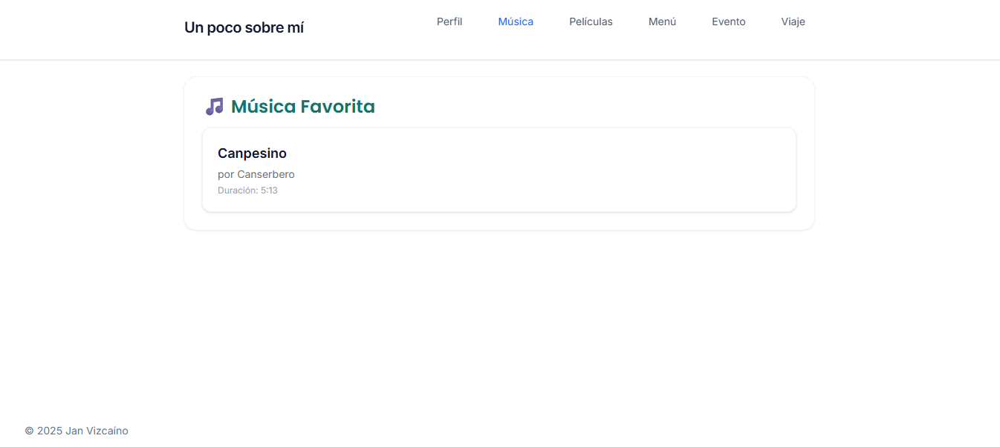
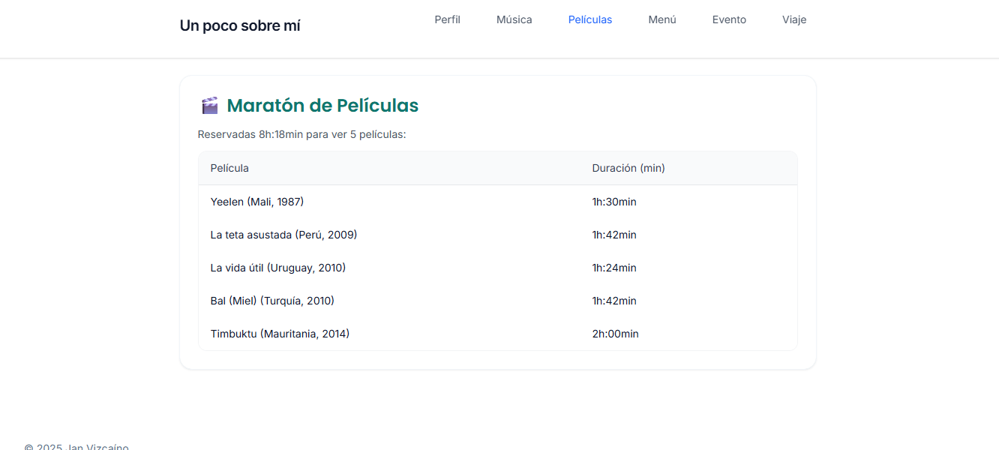
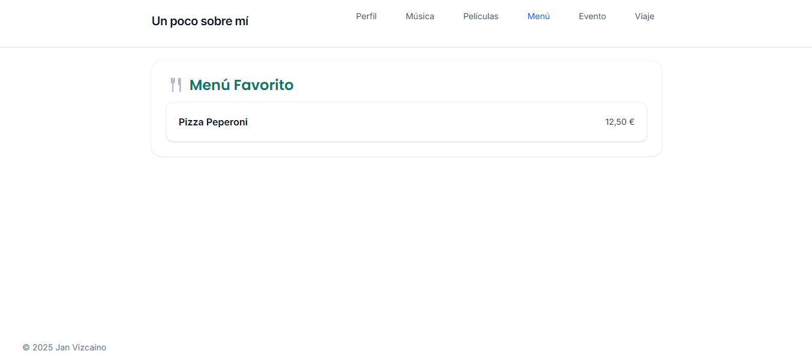
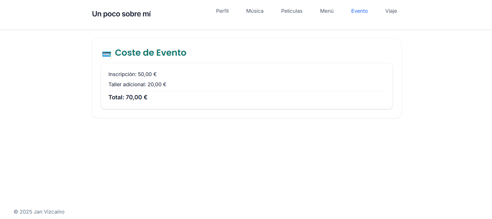
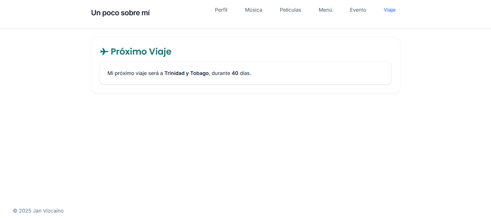

# Proyecto: Perfil Personal Web

## Descripción del proyecto
Este proyecto es una **página web de perfil personal** construida con **PHP** y **TailwindCSS**.
Permite mostrar información de usuario, música favorita, maratón de películas, menú favorito, eventos y próximos viajes.

Características principales:

- Uso de **TailwindCSS** para un diseño moderno, limpio y responsive.
- Navegación por pestañas con efecto de ocultar/mostrar secciones.
- Secciones modulares en PHP para fácil mantenimiento:
  - Perfil personal
  - Música favorita
  - Maratón de películas
  - Menú favorito
  - Coste de eventos
  - Próximo viaje
- Preparado para **despliegue local** usando XAMPP o Docker.

---

## Estructura de carpetas
```
/project-root
├─ includes/
│  ├─ header.php
│  ├─ footer.php
│  └─ tabs.php
├─ sections/
│  ├─ part1-profile.php
│  ├─ part2-music.php
│  ├─ part3-movies.php
│  ├─ part4-menu.php
│  ├─ part5-event.php
│  └─ part6-travel.php
├─ assets/
│  ├─ css/output.css
│  └─ js/tabs.js
├─ index.php
└─ README.md
```

---

## Requisitos

- PHP >= 7.4
- Servidor web (XAMPP, MAMP, WAMP) o Docker
- Navegador moderno (Chrome, Firefox, Edge)

---

## Instrucciones de ejecución

### Opción 1: XAMPP
1. Descargar e instalar [XAMPP](https://www.apachefriends.org/index.html).
2. Colocar la carpeta del proyecto dentro de `C:\xampp\htdocs\` (o equivalente).
3. Abrir **XAMPP Control Panel** y arrancar **Apache**.
4. Abrir navegador y acceder a `http://localhost/nombre-del-proyecto/`.

### Opción 2: Docker
1. Crear un `Dockerfile` en la raíz del proyecto:

```dockerfile
FROM php:8.2-apache
COPY . /var/www/html/
RUN docker-php-ext-install mysqli pdo pdo_mysql
EXPOSE 80
```

2. Construir y ejecutar el contenedor:

```bash
docker build -t perfil-web .
docker run -p 8080:80 perfil-web
```

3. Abrir navegador y acceder a `http://localhost:8080`.

---

## Uso

- Al iniciar, se muestra la **sección Perfil**.
- Para navegar entre secciones, usar la **barra de pestañas** superior.
- Cada sección tiene **información modular** que se puede actualizar fácilmente desde sus archivos PHP correspondientes.

---

## Capturas de pantalla

### Perfil Personal
  
_Muestra el nombre, apellidos y fecha de nacimiento del usuario en un contenedor elegante con sombra y borde redondeado._

### Música Favorita
  
_Sección oculta por defecto, muestra el título y el artista cuando se activa desde la barra de pestañas._

### Maratón de Películas
  
_Tabla responsive con películas, duración y total de horas reservadas._

### Menú Favorito
  
_Sección con nombre del plato y precio, usando un layout limpio con flexbox._

### Evento
  
_Resumen de costes de inscripción y taller adicional con total calculado automáticamente._

### Próximo Viaje
  
_Detalla el destino y duración del viaje con estilo minimalista._

---

## Contribuciones
Se aceptan pull requests y mejoras.  
Sugerencias de diseño, optimización de código y nuevas secciones son bienvenidas.

---

## Licencia
Este proyecto es **open-source** bajo la licencia **MIT**.